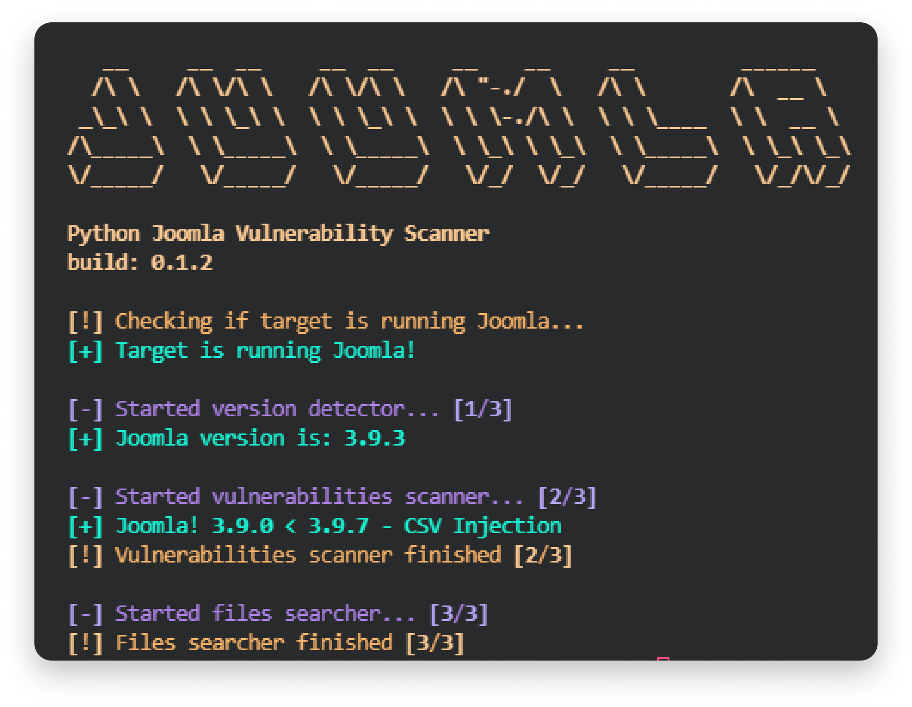

# 🦁 Juumla
<div align="center">
    
</div>

<br>

<p align="center">
    
    
    
    
</p>

<br>

<p> <b>Juumla</b> is a python tool developed to identify the current Joomla version and scan for readable Joomla config files. </p>

<br>

## ⚡ Installing / Getting started

<p> A quick guide of how to install and use Juumla. </p>

```
1. Clone the repository - git clone https://github.com/oppsec/juumla.git
2. Install the libraries - pip3 install -r requirements.txt
3. Run Juumla - python3 main.py -u https://example.com
```

<br>

### 🐳 Docker
If you want to install Juumla in a Docker container, follow this commands:

```
1. Clone the repository - git clone https://github.com/oppsec/juumla.git
2. Build the image - sudo docker build -t juumla:latest .
3. Run container - sudo docker run juumla:latest
```

<br><br>

### ⚙️ Pre-requisites
- [Python 3](https://www.python.org/downloads/) installed on your machine.
- Install the libraries with `pip3 install -r requirements.txt`

<br><br>

### ✨ Features
- Fast scan
- Low RAM and CPU usage
- Identify Joomla version
- Config files detection
- Open-Source

<br><br>

### 📚 To-Do
- [x] Vulnerability Scanner
- [x] Improve Joomla detection
- [x] Config files detection
- [x] Improve code

<br><br>

### 🔨 Contributing

A quick guide of how to contribute with the project.

```
1. Create a fork from Juumla repository
2. Download the project with git clone https://github.com/your/juumla.git
3. Type cd juumla/
4. Make your changes
5. Commit and make a git push
6. Open a pull request
```

<br><br>

### ⚠️ Warning
- The developer is not responsible for any malicious use of this tool.