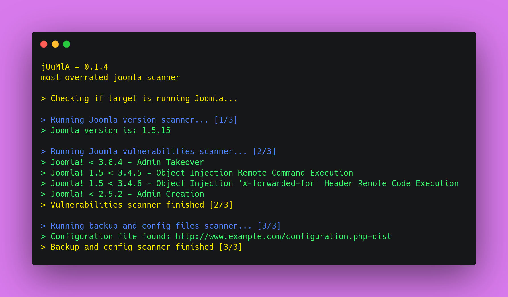

# 🦁 Juumla
<div align="center">
    
</div>

<br>

<p align="center">
    
    
    
    
</p>

___

<br>

<p> 🦁 <b>Juumla</b> is a python tool created to identify Joomla version, scan for vulnerabilities and search for config or backup files. </p>

<br>

## ⚡ Installing / Getting started

<p> A quick guide on how to install and use Juumla. </p>

```
1. Clone the repository - git clone https://github.com/oppsec/juumla.git
2. Install the libraries - pip3 install -r requirements.txt
3. Run Juumla - python3 main.py -u https://example.com
```

<br>

### 🐳 Docker
If you want to run Juumla in a Docker container, follow these commands:

```
1. Clone the repository - git clone https://github.com/oppsec/juumla.git
2. Build the image - sudo docker build -t juumla:latest .
3. Run container - sudo docker run juumla:latest
```

<br><br>

### ⚙️ Pre-requisites
- [Python 3](https://www.python.org/downloads/) installed on your machine.
- Install the libraries with `pip3 install -r requirements.txt`

<br><br>

### ✨ Features
- Fast scan
- Low RAM and CPU usage
- Detect Joomla version
- Find config and backup files
- Scan for vulnerabilities based on the Joomla version
- Open-Source

<br><br>

### 📚 To-Do
- [ ] Update vulnerabilities database
- [ ] Improve Joomla detection methods
- [ ] Update code

<br><br>

### 🔨 Contributing

A quick guide on how to contribute to the project.

```
1. Create a fork from Juumla repository
2. Download the project with git clone https://github.com/your/juumla.git
3. Make your changes
4. Commit and makes a git push
5. Open a pull request
```

<br><br>

### ⚠️ Warning
- The developer is not responsible for any malicious use of this tool.
